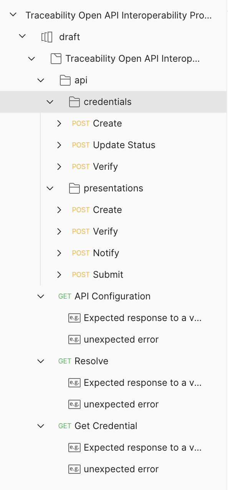

# Traceability Interoperability

[](https://github.com/w3c-ccg/traceability-interop/actions/workflows/interoperability-report.yml)

## Latest Spec

- [https://w3id.org/traceability/interoperability/openapi](https://w3id.org/traceability/interoperability/openapi)

## Latest Reports

- [Multivendor Interoperability Reporting](https://github.com/w3c-ccg/traceability-interop/tree/main/reporting)
- [https://w3id.org/traceability/interoperability/reports](https://w3id.org/traceability/interoperability/reports)

## About

An enterprise grade HTTP API for leveraging [W3C Decentralized Identifiers](https://www.w3.org/TR/did-core/) and [W3C Verifiable Credentials](https://www.w3.org/TR/vc-data-model/) with [W3C CCG Traceability Vocabulary](https://w3c-ccg.github.io/traceability-vocab/) and the [VC API](https://w3c-ccg.github.io/vc-api/) when possible.

## Meetings

Meetings are held

- Tuesdays at 1.30pm ET/10.30pm PT
- on jitsi using this link: [meet.w3c-ccg.org/traceability](https://meet.w3c-ccg.org/traceability)
- with standing agenda to review open [Pull Requests](https://github.com/w3c-ccg/traceability-interop/pulls),
  then [open Issues](https://github.com/w3c-ccg/traceability-interop/issues), unless otherwise noted on the mailing list

### Hosting instructions

Any chair, editor, or other party authorized by CCG to manage recordings and
minutes can do the following. A scribe-bot will show up in the main #ccg IRC
channel automatically.

1. Make sure to select "Start Recording" at the beginning of the call and "Stop
   Recording" when you're done.
2. Make sure to kick everyone out of the room when the meeting is done.
3. Once the last person leaves, everything else is automated (publishing raw IRC
   log, audio, and video). If you want to clean up the minutes, it takes about
   5-10 minutes to clean up the transcription and publish it.

#### Retrieving Minutes

1. Go to [Scribe tool](https://w3c-ccg.github.io/meetings/scribe-tool/)
2. Select "Traceability" from the drop-down at the bottom right.
3. Select a day for the call you're interested in.
4. Click "Retrieve Raw Logs".
5. The display will then render the minutes.

#### Publishing Minutes

[Publish Instructions](https://github.com/w3c-ccg/meetings#publish-the-minutes-for-ccg-meetings-task-forces-and-other-recorded-meetings)

## [Open API Specification](https://w3c-ccg.github.io/traceability-interop/)

The spec contains documentation on use cases as well as required and optional API operations.

### Included scripts for managing OpenAPI Specification

1. `npm run validate-spec`: This command can be used to validate the `openapi.yml` spec, ensuring there are no issues.
2. `npm run preserve`: This command is used to bundle our `openapi.yml` file into an `openapi.json` file that can be used to import the collection/spec.

For additional documentation on how the `swagger-cli` can be used, visit [here](https://www.npmjs.com/package/swagger-cli).

## Importing the OpenAPI Specification Into Postman

If you are using Postman, you can import all of the available API endpoints into an easy to use collection by following the instructions below:

1. While inside a Postman Workspace, you should see an **import** button at the top of your list of collections. Click this to begin the importing process.
2. After clicking **import**, a dialog will open providing you with a couple of options for importing the collection. The easiest is to import using a **Link**. To do this, simply paste the following URL into the input box, and click **Import**: `https://w3c-ccg.github.io/traceability-interop/openapi/openapi.json`. Alternatively, you can use the **Raw text** option by copying the JSON found at `https://w3c-ccg.github.io/traceability-interop/openapi/openapi.json`, and pasting it into the input box.

You should see something like this in your collections once you have succesffuly imported the spec:



## Reference Implementation

In order to simplify the creation of test vectors for the spec, we intend to provide a reference implementation.

This implementation will cover all required AND optional APIs and will be used to ensure no breaking changes are accidentaly contributed to the spec.

## Postman Interoperability Test Suite

In order to ensure interoperability tests are conducted in a manner consistent with production environments, we will be maintaining postman collections and client credential configuration in github actons.

This will allow us to test implementations in production with the appropriate security and authorizaton policies in place.

## Development

```
git clone git@github.com:w3c-ccg/traceability-interop.git
cd traceability-interop
npm i
npm run serve
```
